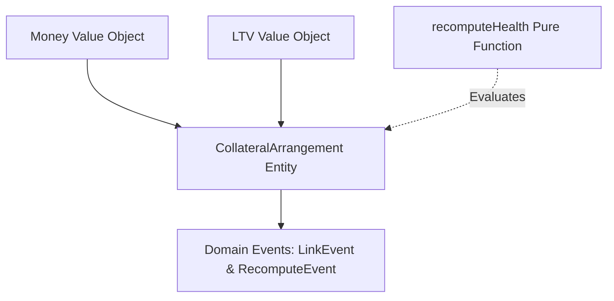

# Collateral Health Engine

A pure TypeScript domain engine for evaluating Collateral Arrangement (CA) health statuses and risk transitions, built with zero external runtime dependencies.

---

## Overview

The **Collateral Health Engine** is a core logic library designed to evaluate the risk of debt-collateral positions. It calculates risk boundaries based on outstanding debt, collateral amounts, asset prices, and Loan-to-Value (LTV) limits, and manages transition states.

The engine evaluates positions across five distinct statuses:

- **`GOOD_STANDING`**: Risk is low; debt is safely below the Initial Limit.
- **`NEAR_MARGIN`**: Debt has crossed the Initial Limit but remains below the Maintenance Limit.
- **`INITIAL_MARGIN_CALL`**: Triggered when a new asset price feed or asset link occurs while the account is under-collateralized.
- **`MAINTENANCE_MARGIN_CALL`**: Debt has crossed the Maintenance Limit, indicating a critical need for collateral top-up.
- **`LIQUIDATION`**: Debt has crossed the Liquidation Limit, making the collateral eligible for liquidation.

---

## Architecture & Design Choices

The project is structured according to the principles of **Domain-Driven Design (DDD)** and functional programming:



### 1. Domain-Driven Design (DDD)

- **Value Objects (`Money`, `LTV`)**: Immutable structures that encapsulate value, validation rules, and safe arithmetic operators. They protect their invariants at instantiation (e.g., preventing negative money or LTV percentage values).
- **Aggregate Root (`CollateralArrangement`)**: Manages the collateral position state and exposes mutation methods. It serves as the single source of truth for the position, ensuring invariants like currency consistency and threshold order limits are strictly maintained.

### 2. Pure Recalculation Engine

The core transition logic is separated from the stateful entity and implemented as a pure function:

```typescript
recomputeHealth(ca: CollateralArrangement, event: EventType): HealthStatus
```

This design isolates the business rule engine, making it deterministic, side-effect free, and easily testable under any permutation of inputs.

### 3. State Machine Transitions

Risk transitions depend on both the incoming event (e.g., `LINK_EVENT` vs. `RECOMPUTE_EVENT`) and the previous health status of the arrangement. This architecture handles hysteresis, protection boundaries, and precedence criteria.

### 4. Zero-Dependency Strategy

The library has **zero runtime dependencies** (no databases, frameworks, or utility libraries). This minimizes package footprint, avoids supply-chain vulnerabilities, and ensures compatibility across Node.js, browsers, Deno, and serverless environments.

---

## Assumptions & Spec Discrepancies Handled

### 1. Rule 6 (INITIAL_MARGIN_CALL Promotion Lock)

- **Rule**: An account in `INITIAL_MARGIN_CALL` cannot be promoted to `MAINTENANCE_MARGIN_CALL` or `LIQUIDATION`. (If debt crosses higher limits, keep status as `INITIAL_MARGIN_CALL`).
- **Implementation Assumption**: A position locked in `INITIAL_MARGIN_CALL` stays in this state even if the LTV climbs into the maintenance or liquidation range. It remains locked until it is cured by dropping strictly below the Initial Limit, which transitions it back to `GOOD_STANDING`.

### 2. Rule 7 (Hysteresis Recovery)

- **Rule**: An account in `MAINTENANCE_MARGIN_CALL` or `LIQUIDATION` only returns to `GOOD_STANDING` if debt drops below the Initial Limit.
- **Implementation Assumption**: If the previous status is `LIQUIDATION` and the debt is reduced below the Liquidation Limit (but remains above the Initial Limit), the status transitions down to `MAINTENANCE_MARGIN_CALL` (remaining in the critical recovery zone). It cannot return to `NEAR_MARGIN` or `GOOD_STANDING` unless it fully clears the Initial Limit boundary.

### 3. Precedence Check (Equal Thresholds)

- **Rule**: When thresholds are equal (e.g. Initial LTV = Maintenance LTV = Liquidation LTV) and debt lands exactly on the limit, the most severe status takes precedence (`LIQUIDATION` > `MAINTENANCE_MARGIN_CALL` > `INITIAL_MARGIN_CALL` > `NEAR_MARGIN`).
- **Implementation Assumption**: Checking limits sequentially starting from the most critical (`LIQUIDATION` down to `NEAR_MARGIN`) using `>=` checks ensures the highest severity state is correctly selected when limits overlap.

### 4. Zero Debt Handling

- **Implementation Assumption**: If the outstanding debt is exactly zero, the arrangement is always in `GOOD_STANDING` regardless of the previous status or any active hysteresis rules.

### 5. Zero Collateral & Infinite LTV

- **Implementation Assumption**: If collateral amount drops to zero while debt remains positive, LTV becomes mathematically `Infinity`. The `LTV` value object has been modified to accept `Infinity` (while rejecting `NaN`), ensuring the position is correctly flags as `LIQUIDATION`.

---

## What was left out / Future Work

Because this is a pure domain library, the following features are out of scope and would be handled in the application layer:

1. **Persistence**:
   The library does not contain database adapters. In production, a repository pattern would be implemented to fetch and save `CollateralArrangement` states to a database (e.g. PostgreSQL, DynamoDB).
2. **Event Streaming**:
   The domain events generated during mutations (retrieved via `ca.pullEvents()`) must be published to a message broker (e.g., Kafka, RabbitMQ) to trigger downstream events like email alerts, ledger modifications, or execution of liquidations.
3. **Oracle Integrations / Dynamic Feeds**:
   Price updates are passed directly to the domain entity. Connecting to decentralized oracle feeds (e.g., Chainlink) or price APIs would be handled by an orchestrator service.
4. **Race-Condition & Concurrency Handling**:
   In high-frequency environments, concurrent updates (e.g., simultaneous price feeds and debt draws) can cause race conditions. Optimistic concurrency control (via a version attribute on the `CollateralArrangement` aggregate) should be implemented at the database level.

---

## How to Run Tests

### Prerequisites

- **Node.js** (v20+ recommended)
- **npm** (v10+ recommended)

### 1. Install Dependencies

Install development dependencies (TypeScript, Vitest, and Node types):

```bash
npm install
```

### 2. Run the Test Suite

Run the test suite using Vitest:

```bash
npm run test
```

### 3. Build the Library

Compile the TypeScript code and generate type definitions (`.d.ts` files):

```bash
npm run build
```

The compiled output will be generated inside the `dist/` directory.
